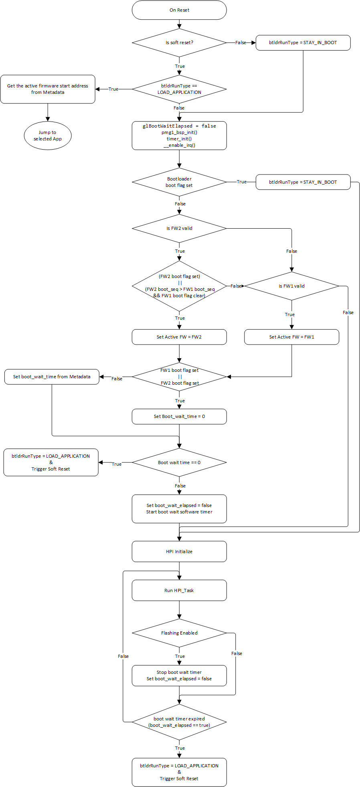
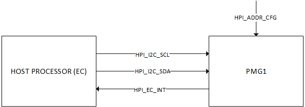
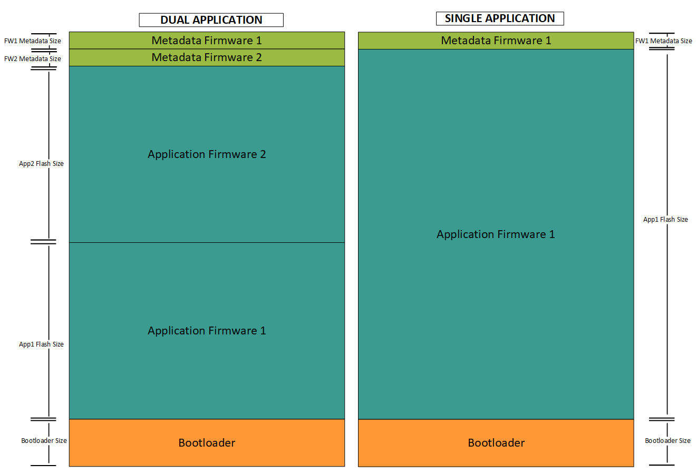

# EZ-PD&trade; PMG1 MCU: I2C bootloader

This example demonstrates the I2C-based firmware update on the EZ-PD&trade; PMG1 MCU devices using the Host Processor Interface (HPI). The bootloader handles application firmware image download, verification, and upgrades.

[View this README on GitHub.](https://github.com/Infineon/mtb-example-pmg1-i2c-bootloader)

[Provide feedback on this code example.](https://cypress.co1.qualtrics.com/jfe/form/SV_1NTns53sK2yiljn?Q_EED=eyJVbmlxdWUgRG9jIElkIjoiQ0UyMzY5NDciLCJTcGVjIE51bWJlciI6IjAwMi0zNjk0NyIsIkRvYyBUaXRsZSI6IkVaLVBEJnRyYWRlOyBQTUcxIE1DVTogSTJDIGJvb3Rsb2FkZXIiLCJyaWQiOiJrdW1hcm1hIiwiRG9jIHZlcnNpb24iOiIxLjAuMCIsIkRvYyBMYW5ndWFnZSI6IkVuZ2xpc2giLCJEb2MgRGl2aXNpb24iOiJNQ0QiLCJEb2MgQlUiOiJXSVJFRCIsIkRvYyBGYW1pbHkiOiJUWVBFLUMifQ==)


## Requirements

- [ModusToolbox&trade;](https://www.infineon.com/modustoolbox) v3.3 or later (tested with v3.3)
- Board support package (BSP) minimum required version: 3.0.0
- Programming language: C
- Associated parts: [EZ-PD&trade; PMG1-Sx MCUs](https://www.infineon.com/PMG1)


## Supported toolchains (make variable 'TOOLCHAIN')

- GNU Arm&reg; Embedded Compiler v11.3.1 (`GCC_ARM`) – Default value of `TOOLCHAIN`
- Arm&reg; Compiler v6.22 (`ARM`)
- IAR C/C++ Compiler v9.50.2 (`IAR`)


## Supported kits (make variable 'TARGET')

- [EZ-PD&trade; PMG1-S0 Prototyping Kit](https://www.infineon.com/CY7110) (`PMG1-CY7110`) – Default value of `TARGET`
- [EZ-PD&trade; PMG1-S1 evaluation kit](https://www.infineon.com/EVAL_PMG1_S1_DRP) (`EVAL_PMG1_S1_DRP`)
- [EZ-PD&trade; PMG1-S2 Prototyping Kit](https://www.infineon.com/CY7112) (`PMG1-CY7112`)
- [EZ-PD&trade; PMG1-S3 Prototyping Kit](https://www.infineon.com/CY7113) (`PMG1-CY7113`)
- [EZ-PD&trade; PMG1-S3 evaluation kit](https://www.infineon.com/EVAL_PMG1_S3_DUALDRP) (`EVAL_PMG1_S3_DUALDRP`)

> **Note:** See [AN235644 – USB PD DRP (dual-role power) schematics using EZ-PD&trade; PMG1 MCUs](https://www.infineon.com/an235644) for more details.


## Hardware setup

1. Setup the hardware with MCU connections according to the USB PD DRP reference schematics mentioned in the [AN235644 – USB PD DRP (dual-role power) schematics using EZ-PD&trade; PMG1 MCUs](https://www.infineon.com/an235644).

2. Ensure that the HPI hardware connections from EZ-PD&trade; PMG1 MCU are according to the following tables:
  
   **Table 1. EZ-PD&trade; PMG1 kit HPI connection**    

   EZ-PD&trade; PMG1 device      |  HPI_I2C_SCL  |  HPI_I2C_SDA  |  HPI_EC_INT  | HPI_ADDR_CFG 
   :-------         | :------------ | :----------   | :---------   | :---------   
   PMG1-S0          | J8.2(P0.1)    | J8.1(P0.0)    | J8.7(P2.2)   | J9.2(P2.0)   
   PMG1-S1          | J7.6(P5.1)    | J7.7(P5.0)    | J7.15(P2.2)  | J6.15(P3.2)     
   PMG1-S2          | J9.7(P3.5)    | J9.8(P3.4)    | J9.9(P3.2)   | J1.4(P2.1)   
   PMG1-S3          | J29.7(P4.0)   | J29.8(P4.1)   | J29.18(P3.6) | J2.3(P3.5)   
   PMG1-S3 DUAL     | J6.14(P4.0)   | J6.15(P4.1)   | J13.5(P3.7)  | J13.7(P3.4)  
   <br>

   GPIO pin **HPI_ADDR_CFG** is used to set HPI slave address. Bootloader can work with three different slave addresses.
   
   **Table 2. HPI slave address selection**

   HPI_ADDR_CFG drive mode | HPI slave address
   :-------------          | :--------------  
   Pull-Up                 | 0x42            
   Pull-Down               | 0x40              
   High-Z                  | 0x08             
<br>

3. Provide the 24 V, 5 A power to power up the PMG1-S1, PMG1-S2, and PMG1-S3 boards and 12 V, 5 A power to power up the PMG1-S0 board in source mode.

4. Use the SWD programming header for flashing the MCU.


## Software setup

See the [ModusToolbox&trade; tools package installation guide](https://www.infineon.com/ModusToolboxInstallguide) for information about installing and configuring the tools package.

This code example does not need any additional software or tools. However, [EZ-PD&trade; Protocol Analyzer Utility](https://www.infineon.com/cms/en/product/evaluation-boards/cy4500) can be used to analyze and debug the USB PD communication on the Configuration Channel (CC) line.


## Using the code example


### Create the project

The ModusToolbox&trade; tools package provides the Project Creator as both a GUI tool and a command line tool.

<details><summary><b>Use Project Creator GUI</b></summary>

1. Open the Project Creator GUI tool.

   There are several ways to do this, including launching it from the dashboard or from inside the Eclipse IDE. For more details, see the [Project Creator user guide](https://www.infineon.com/ModusToolboxProjectCreator) (locally available at *{ModusToolbox&trade; install directory}/tools_{version}/project-creator/docs/project-creator.pdf*).

2. On the **Choose Board Support Package (BSP)** page, select a kit supported by this code example. See [Supported kits](#supported-kits-make-variable-target).

   > **Note:** To use this code example for a kit not listed here, you may need to update the source files. If the kit does not have the required resources, the application may not work.

3. On the **Select Application** page:

   a. Select the **Applications(s) Root Path** and the **Target IDE**.

   > **Note:** Depending on how you open the Project Creator tool, these fields may be pre-selected for you.

   b. Select this code example from the list by enabling its check box.

   > **Note:** You can narrow the list of displayed examples by typing in the filter box.

   c. (Optional) Change the suggested **New Application Name** and **New BSP Name**.

   d. Click **Create** to complete the application creation process.

</details>


<details><summary><b>Use Project Creator CLI</b></summary>

The 'project-creator-cli' tool can be used to create applications from a CLI terminal or from within batch files or shell scripts. This tool is available in the *{ModusToolbox&trade; install directory}/tools_{version}/project-creator/* directory.

Use a CLI terminal to invoke the 'project-creator-cli' tool. On Windows, use the command-line 'modus-shell' program provided in the ModusToolbox&trade; installation instead of a standard Windows command-line application. This shell provides access to all ModusToolbox&trade; tools. You can access it by typing "modus-shell" in the search box in the Windows menu. In Linux and macOS, you can use any terminal application.

The following example clones the "[EZ-PD&trade; PMG1 I2C bootloader](https://github.com/Infineon/mtb-example-pmg1-i2c-bootloader)" application with the desired name "Pmg1I2cBootloader" configured for the *PMG1-CY7113* BSP into the specified working directory, *C:/mtb_projects*:

   ```
   project-creator-cli --board-id PMG1-CY7113 --app-id mtb-example-pmg1-i2c-bootloader --user-app-name Pmg1I2cBootloader --target-dir "C:/mtb_projects"
   ```


The 'project-creator-cli' tool has the following arguments:

Argument | Description | Required/optional
---------|-------------|-----------
`--board-id` | Defined in the <id> field of the [BSP](https://github.com/Infineon?q=bsp-manifest&type=&language=&sort=) manifest | Required
`--app-id`   | Defined in the <id> field of the [CE](https://github.com/Infineon?q=ce-manifest&type=&language=&sort=) manifest | Required
`--target-dir`| Specify the directory in which the application is to be created if you prefer not to use the default current working directory | Optional
`--user-app-name`| Specify the name of the application if you prefer to have a name other than the example's default name | Optional

<br>

> **Note:** The project-creator-cli tool uses the `git clone` and `make getlibs` commands to fetch the repository and import the required libraries. For details, see the "Project creator tools" section of the [ModusToolbox&trade; tools package user guide](https://www.infineon.com/ModusToolboxUserGuide) (locally available at {ModusToolbox&trade; install directory}/docs_{version}/mtb_user_guide.pdf).

</details>


### Open the project

After the project has been created, you can open it in your preferred development environment.


<details><summary><b>Eclipse IDE</b></summary>

If you opened the Project Creator tool from the included Eclipse IDE, the project will open in Eclipse automatically.

For more details, see the [Eclipse IDE for ModusToolbox&trade; user guide](https://www.infineon.com/MTBEclipseIDEUserGuide) (locally available at *{ModusToolbox&trade; install directory}/docs_{version}/mt_ide_user_guide.pdf*).

</details>


<details><summary><b>Visual Studio (VS) Code</b></summary>

Launch VS Code manually, and then open the generated *{project-name}.code-workspace* file located in the project directory.

For more details, see the [Visual Studio Code for ModusToolbox&trade; user guide](https://www.infineon.com/MTBVSCodeUserGuide) (locally available at *{ModusToolbox&trade; install directory}/docs_{version}/mt_vscode_user_guide.pdf*).

</details>


<details><summary><b>Keil µVision</b></summary>

Double-click the generated *{project-name}.cprj* file to launch the Keil µVision IDE.

For more details, see the [Keil µVision for ModusToolbox&trade; user guide](https://www.infineon.com/MTBuVisionUserGuide) (locally available at *{ModusToolbox&trade; install directory}/docs_{version}/mt_uvision_user_guide.pdf*).

</details>


<details><summary><b>IAR Embedded Workbench</b></summary>

Open IAR Embedded Workbench manually, and create a new project. Then select the generated *{project-name}.ipcf* file located in the project directory.

For more details, see the [IAR Embedded Workbench for ModusToolbox&trade; user guide](https://www.infineon.com/MTBIARUserGuide) (locally available at *{ModusToolbox&trade; install directory}/docs_{version}/mt_iar_user_guide.pdf*).

</details>


<details><summary><b>Command line</b></summary>

If you prefer to use the CLI, open the appropriate terminal, and navigate to the project directory. On Windows, use the command-line 'modus-shell' program; on Linux and macOS, you can use any terminal application. From there, you can run various `make` commands.

For more details, see the [ModusToolbox&trade; tools package user guide](https://www.infineon.com/ModusToolboxUserGuide) (locally available at *{ModusToolbox&trade; install directory}/docs_{version}/mtb_user_guide.pdf*).

</details>


## Operation

1. Ensure that the steps listed in the [Hardware setup](#hardware-setup) section are completed.

2. Program the board using one of the following:

   <details><summary><b>Using Eclipse IDE</b></summary>

      1. Select the application project in the Project Explorer.

      2. In the **Quick Panel**, scroll down, and click **\<Application Name> Program (KitProg3_MiniProg4)**.
   </details>


   <details><summary><b>In other IDEs</b></summary>

   Follow the instructions in your preferred IDE.
   </details>


   <details><summary><b>Using CLI</b></summary>

     From the terminal, execute the `make program` command to build and program the application using the default toolchain to the default target. The default toolchain is specified in the application's Makefile but you can override this value manually:
      ```
      make program TOOLCHAIN=<toolchain>
      ```

      Example:
      ```
      make program TOOLCHAIN=GCC_ARM
      ```
   </details>


## Debugging

You can debug the example to step through the code.


<details><summary><b>In Eclipse IDE</b></summary>

Use the **\<Application Name> Debug (KitProg3_MiniProg4)** configuration in the **Quick Panel**. For details, see the "Program and debug" section in the [Eclipse IDE for ModusToolbox&trade; user guide](https://www.infineon.com/MTBEclipseIDEUserGuide).


</details>


<details><summary><b>In other IDEs</b></summary>

Follow the instructions in your preferred IDE.

</details>


## Design and implementation


To utilize this bootloader, build the project and place the generated binaries (*.elf* files) in the bootloader folder of the [USBPD DRP HPI](https://github.com/Infineon/mtb-example-pmg1-usbpd-drp-hpi) application project. The bootloader's primary function is to validate and load the application firmware. If the application firmware is valid, the bootloader loads it; otherwise, it remains in bootloader mode, allowing for firmware updates. The bootloader's workflow is illustrated in **Figure 1**.
<br>

**HPI interface** <br>
The bootloader uses the HPI to communicate with the host processors or embedded controllers (EC) over the I2C protocol. The host processor and EC are responsible for performing firmware updates and making device policy. The bootloader utilizes the following key features of the HPI to perform firmware updates and image validation:
- Firmware version identification
- Device mode identification
- Firmware image validation
- Jump to boot or alternate firmware
- Flash memory read and write operations

**Architecture** <br>
The bootloader supports both single and dual application architecture modes.

   - **Single application mode:** In single application mode, the flash memory contains a bootloader and a single application firmware. The bootloader is responsible for validating and loading the application image. The bootloader can only update the application firmware. <br><br>
   - **Dual application mode:** In dual application mode, the flash memory contains a bootloader and two copies of the application firmware. In this configuration, the bootloader is responsible for validating and loading the application image, as it does in single application mode. Additionally, each application firmware has the capability to update and validate the alternate application firmware.

**Slave address identification** <br>
At initialization, the bootloader identifies the I2C slave address based on the `HPI_ADDR_CFG` GPIO drive mode. The address will be selected as per **Table 2**. This identified I2C address is used by the bootloader to communicate and the same address is passed to the application firmware to communicate.


**Figure 1. Bootloader flowchart**
<br>


**Figure 2. Host processor - EZ-PD&trade; PMG1 hardware interface**
<br>


### Memory layout
The first 7168 bytes of the flash memory is reserved for the bootloader and the last two rows of flash memory is reserved for the application metadata. Remaining flash space is used by the application firmware. The size allocated to the application firmware can vary depending on the size of the flash available on the target device.
The RAM memory is shared between the bootloader and the applications.

**Figure 3. Flash memory layout**
<br>



### Resources and settings

**Table 3. Application resources**

Resource  | Alias/object   | Purpose                                               
:-------  | :------------  | :------------------------------------                 
I2C(BSP)  | HPI_I2C        | I2C object used for communication     
GPIO      | HPI_EC_INT     | Notifies EC of interrupt              
GPIO      | HPI_ADDR_CFG   | Used to set HPI slave address         

### List of application files and their usage

**Table 4. Application files and their usage**

File                         | Purpose 
:--------------------------- | :------------------------------------ 
*src/system/boot.c & .h*     | Defines function prototype and implements the system boot functionalities.           
*src/system/flash.c & .h*    | Defines function prototype and implements the flash read and write operation.       
*src/system/pmg1_bsp.c & .h* | Defines function prototype and implements the PMG1 clock and peripheral initialization. 
*src/system/timer.c & .h*    | Defines function prototype and implements the software timer module. 
*src/system/status.h*        | Contains system status code and common utility macros. 
*config.h*                   | Contains macro definitions enabling/disabling the application-specific features.     

<br>


## Related resources

Resources | Links
-----------|------------------
Application notes |[AN232553](https://www.infineon.com/an232553) – Getting started with EZ-PD&trade; PMG1 MCU on ModusToolbox&trade; software <br> [AN232565](https://www.infineon.com/an232565) – EZ-PD&trade; PMG1 MCU hardware design guidelines and checklist <br> [AN235644](https://www.infineon.com/an235644) – USB PD DRP (dual-role power) schematics using EZ-PD&trade; PMG1 MCUs
Code examples | [Using ModusToolbox&trade;](https://github.com/Infineon?q=mtb-example-pmg1%20NOT%20Deprecated) on GitHub
Device documentation | [EZ-PD&trade; PMG1 MCU datasheets](https://www.infineon.com/PMG1DS)
Development kits | Select your kits from the [Evaluation board finder](https://www.infineon.com/cms/en/design-support/finder-selection-tools/product-finder/evaluation-board).
Libraries on GitHub | [mtb-pdl-cat2](https://github.com/Infineon/mtb-pdl-cat2) – Peripheral Driver Library (PDL) and docs
Middleware on GitHub  | [pdutils](https://github.com/Infineon/pdutils) – PDUtils middleware library and docs <br> [hpi](https://github.com/Infineon/hpi) – HPI middleware library and docs
Tools  | [ModusToolbox&trade;](https://www.infineon.com/modustoolbox) – ModusToolbox&trade; software is a collection of easy-to-use libraries and tools enabling rapid development with Infineon MCUs for applications ranging from wireless and cloud-connected systems, edge AI/ML, embedded sense and control, to wired USB connectivity using PSOC&trade; Industrial/IoT MCUs, AIROC&trade; Wi-Fi and Bluetooth&reg; connectivity devices, XMC&trade; Industrial MCUs, and EZ-USB&trade;/EZ-PD&trade; wired connectivity controllers. ModusToolbox&trade; incorporates a comprehensive set of BSPs, HAL, libraries, configuration tools, and provides support for industry-standard IDEs to fast-track your embedded application development.

<br>


## Other resources

Infineon provides a wealth of data at [www.infineon.com](https://www.infineon.com) to help you select the right device, and quickly and effectively integrate it into your design.


## Document history

Document title: *CE236947* – *EZ-PD&trade; PMG1 MCU: I2C bootloader*

 Version | Description of change
 ------- | ---------------------
 1.0.0   | New code example

<br>


All referenced product or service names and trademarks are the property of their respective owners.

The Bluetooth&reg; word mark and logos are registered trademarks owned by Bluetooth SIG, Inc., and any use of such marks by Infineon is under license.


---------------------------------------------------------

© Cypress Semiconductor Corporation, 2024. This document is the property of Cypress Semiconductor Corporation, an Infineon Technologies company, and its affiliates ("Cypress").  This document, including any software or firmware included or referenced in this document ("Software"), is owned by Cypress under the intellectual property laws and treaties of the United States and other countries worldwide.  Cypress reserves all rights under such laws and treaties and does not, except as specifically stated in this paragraph, grant any license under its patents, copyrights, trademarks, or other intellectual property rights.  If the Software is not accompanied by a license agreement and you do not otherwise have a written agreement with Cypress governing the use of the Software, then Cypress hereby grants you a personal, non-exclusive, nontransferable license (without the right to sublicense) (1) under its copyright rights in the Software (a) for Software provided in source code form, to modify and reproduce the Software solely for use with Cypress hardware products, only internally within your organization, and (b) to distribute the Software in binary code form externally to end users (either directly or indirectly through resellers and distributors), solely for use on Cypress hardware product units, and (2) under those claims of Cypress's patents that are infringed by the Software (as provided by Cypress, unmodified) to make, use, distribute, and import the Software solely for use with Cypress hardware products.  Any other use, reproduction, modification, translation, or compilation of the Software is prohibited.
<br>
TO THE EXTENT PERMITTED BY APPLICABLE LAW, CYPRESS MAKES NO WARRANTY OF ANY KIND, EXPRESS OR IMPLIED, WITH REGARD TO THIS DOCUMENT OR ANY SOFTWARE OR ACCOMPANYING HARDWARE, INCLUDING, BUT NOT LIMITED TO, THE IMPLIED WARRANTIES OF MERCHANTABILITY AND FITNESS FOR A PARTICULAR PURPOSE.  No computing device can be absolutely secure.  Therefore, despite security measures implemented in Cypress hardware or software products, Cypress shall have no liability arising out of any security breach, such as unauthorized access to or use of a Cypress product. CYPRESS DOES NOT REPRESENT, WARRANT, OR GUARANTEE THAT CYPRESS PRODUCTS, OR SYSTEMS CREATED USING CYPRESS PRODUCTS, WILL BE FREE FROM CORRUPTION, ATTACK, VIRUSES, INTERFERENCE, HACKING, DATA LOSS OR THEFT, OR OTHER SECURITY INTRUSION (collectively, "Security Breach").  Cypress disclaims any liability relating to any Security Breach, and you shall and hereby do release Cypress from any claim, damage, or other liability arising from any Security Breach.  In addition, the products described in these materials may contain design defects or errors known as errata which may cause the product to deviate from published specifications. To the extent permitted by applicable law, Cypress reserves the right to make changes to this document without further notice. Cypress does not assume any liability arising out of the application or use of any product or circuit described in this document. Any information provided in this document, including any sample design information or programming code, is provided only for reference purposes.  It is the responsibility of the user of this document to properly design, program, and test the functionality and safety of any application made of this information and any resulting product.  "High-Risk Device" means any device or system whose failure could cause personal injury, death, or property damage.  Examples of High-Risk Devices are weapons, nuclear installations, surgical implants, and other medical devices.  "Critical Component" means any component of a High-Risk Device whose failure to perform can be reasonably expected to cause, directly or indirectly, the failure of the High-Risk Device, or to affect its safety or effectiveness.  Cypress is not liable, in whole or in part, and you shall and hereby do release Cypress from any claim, damage, or other liability arising from any use of a Cypress product as a Critical Component in a High-Risk Device. You shall indemnify and hold Cypress, including its affiliates, and its directors, officers, employees, agents, distributors, and assigns harmless from and against all claims, costs, damages, and expenses, arising out of any claim, including claims for product liability, personal injury or death, or property damage arising from any use of a Cypress product as a Critical Component in a High-Risk Device. Cypress products are not intended or authorized for use as a Critical Component in any High-Risk Device except to the limited extent that (i) Cypress's published data sheet for the product explicitly states Cypress has qualified the product for use in a specific High-Risk Device, or (ii) Cypress has given you advance written authorization to use the product as a Critical Component in the specific High-Risk Device and you have signed a separate indemnification agreement.
<br>
Cypress, the Cypress logo, and combinations thereof, ModusToolbox, PSoC, CAPSENSE, EZ-USB, F-RAM, and TRAVEO are trademarks or registered trademarks of Cypress or a subsidiary of Cypress in the United States or in other countries. For a more complete list of Cypress trademarks, visit www.infineon.com. Other names and brands may be claimed as property of their respective owners.
